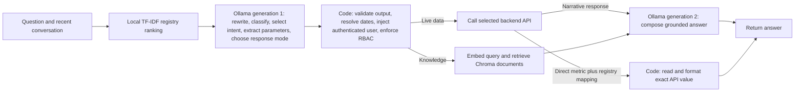

# Combined ChronAI Request Flow

## Goal

The normal chat path combines follow-up rewriting, category routing, app
intent selection, and live-data parameter extraction into one structured
Ollama text-generation request. The final response remains a separate
generation request so it can use the data returned by the API or knowledge
retrieval.

Intent candidates are ranked locally from the active API registry with TF-IDF.
This avoids an embedding-model request for live-data intent lookup and does
not depend on intent-specific keyword rules or hard-coded employee data.

## Request flow

## Call counts

| Request type | Ollama text-generation calls | Other model requests |
|---|---:|---|
| Live data with a generated answer | 2 | None for intent lookup; registry ranking is local |
| Live data with one registry-mapped metric | 1 | First model call selects direct-metric mode; field reading and formatting are local |
| Knowledge-base question | 2 | One embedding request for Chroma retrieval |
| Small talk | 2 | None |
| Off-topic request | 1 | None; the app returns its fixed refusal after routing |
| Reply to a pending clarification | At most 2 | A multi-field reply may use one extraction call, then final generation |

The two-call target refers to text generation. Knowledge retrieval still uses
the configured embedding model because Chroma was indexed with document
embeddings; that request is separate from text generation.

For configured live-data metrics, the response service reads aliases, API
field paths, aggregation, and display format from the selected registry entry.
It returns the value directly when one metric clearly matches the question.
The first model call must classify it as a direct single-metric request.
Other requests continue through the existing final-answer generation path.
The active registry configures 20 intents across six inspected endpoint
families, including activity metrics, efficiency values, and the latest
approved leave date. Other intents use the current answer-generation path
until their response fields are described in metadata.

## Files changed and why

| File | Change | Reason |
|---|---|---|
| `rag/chronai.py` | Replaced separate follow-up rewrite, category, and app-intent calls with one request-analysis call. Carries the validated analysis into routing. | Removes sequential generation calls from the active `/chat` path. |
| `rag/services/request_analysis_service.py` | Added one coordinator that loads usable registry entries, ranks candidates locally, calls the unified analyzer once, and validates its category, intent, and selected registry entry. | Keeps routing data-driven and ensures the model can select only a supplied registry candidate. |
| `rag/prompts/request_analysis_prompt.py` | Added the combined structured-output prompt for follow-up handling, category, app intent, registry selection, and parameter extraction. | Consolidates the former prompt stages while requiring exact registry names and JSON output. |
| `rag/prompts/request_analysis_prompt.py` and `rag/services/request_analysis_service.py` | Adds and carries a direct-metric versus narrative mode from the first classification call. | Keeps rankings, comparisons, summaries, and lists out of the direct-answer path. |
| `rag/services/intent_retriever.py` | Replaced per-question Ollama embeddings for intent candidate lookup with local TF-IDF ranking over registry names, descriptions, and question examples. | Removes a model request from live-data routing and derives matches from registry content rather than hard-coded intent phrases. |
| `rag/config.py` | Added `REGISTRY_CANDIDATE_COUNT` with an environment-variable override. | Lets deployment tune candidate count without editing code. |
| `rag/pipelines/live_data_pipeline.py` | Uses the selected registry entry and extracted parameters supplied by the combined analysis; retains application-side RBAC, validation, API execution, and final response generation. | Prevents the live-data pipeline from repeating intent analysis and parameter extraction. |
| `rag/services/parameter_service.py` | Accepts already-extracted parameters, filters them to the selected registry’s declared parameters, injects authenticated identity, and resolves dates in code. | Avoids a second extraction generation call and keeps trusted values under application control. |
| `rag/services/response_service.py` | Added a generic registry-metadata response path for one metric, including dotted field lookup, optional list aggregation, and duration formatting. | Returns an exact API value without another model call when one configured metric matches the request. |
| `rag/pipelines/live_data_pipeline.py` | Passes the selected entry’s response metric metadata to the response service. | Keeps response field selection in registry data instead of intent-specific Python code. |
| `registry/API_Registry_Correct.xlsx` | Source of the response metric aliases, data paths, aggregation, formats, and suffixes. | Keeps registry changes in Excel before JSON generation. |
| `rag/registry/registry_converter.py` | Converts response metric JSON text stored in Excel cells to native JSON values. | Preserves structured response metadata in the generated registry. |

## Registry source and safety

The active runtime registry is `registry/api_registry_Correct.json`, generated
from `registry/API_Registry_Correct.xlsx` and loaded by `APIRegistryService`.
The candidate ranker indexes the registry's available
intent names, descriptions, and example-question fields; adding or updating a
registry entry does not require adding a matching hard-coded phrase in Python.

The model does not authorize access. Python validates its selected intent
against the supplied candidates, filters parameter keys against the selected
registry entry, resolves dates, injects the authenticated user's ID, and runs
the existing RBAC checks before calling the backend.

## Deployment note

Deploy these files to the Ubuntu ChronRAG checkout, then restart the RAG
service. Knowledge answers still require the embedding model and Chroma
collection configured for that deployment. The old intent embedding cache is
not used by the new registry ranker and does not need to be deleted.

No tests were run for this change, as requested.
